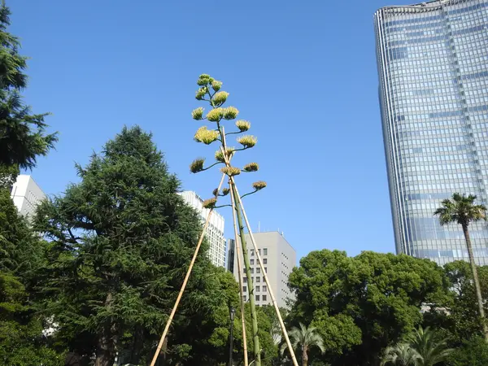
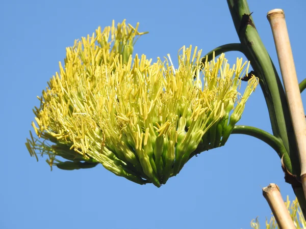
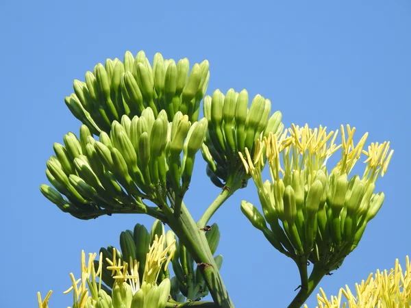
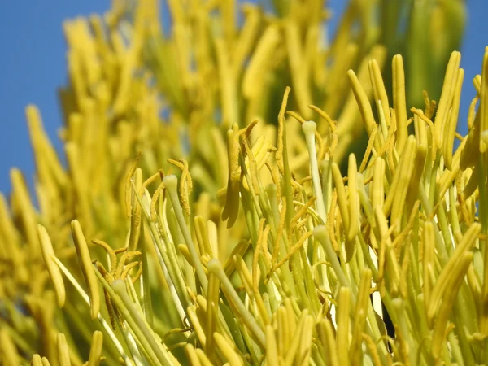

## 2019年夏、日比谷公園にて開花したアオノリュウゼツランの記録

**アオノリュウゼツラン**
（学名：*Agave americana*    キジカクシ科リュウゼツラン亜科）

成長が遅く、開花までに数十年かかることから、100年に一度咲く花「センチュリー・プラント」とも

日本では30~50年ほどでの開花サイクルになっている

現在主流のAPG体系という分類法ではキジカクシ科（Asparagaceae）のリュウゼツラン亜科で**アスパラガスと同じ科**

多肉植物アオノリュウゼツランはリュウゼツラン属(アガベ属)の代表格となっている

-以下アガベの仲間での有名なもの-

- アガベ・テキラーナ
 :お酒のテキーラの原料

- サイザルアサ :葉からの丈夫な繊維がロープやタワシの原料になる

といったものが知られ、他にも観賞用の園芸品種などがある

### 【観賞の記録】
この日はよく晴れていたのを覚えている

約7~8mにもなりビルを見上げるようにみたアオノリュウゼツランは数十年分のエネルギーを爆発させているような力強さを見せてくれた

一回結実性（モノカルピック）であるアオノリュウゼツランは花を咲かせたら枯れてしまう

この株の最後の輝きに立ち会えたことの感慨深さと植物の美しさを改めて感じた

開花サイクルは長いものの、日本各地や同所でも若い株や、別の株がその姿を見せてくれることも

近場で咲くことがありましたら是非、観賞に訪れてみると面白い植物かと思います

---

