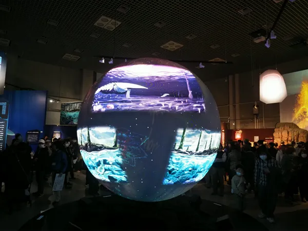
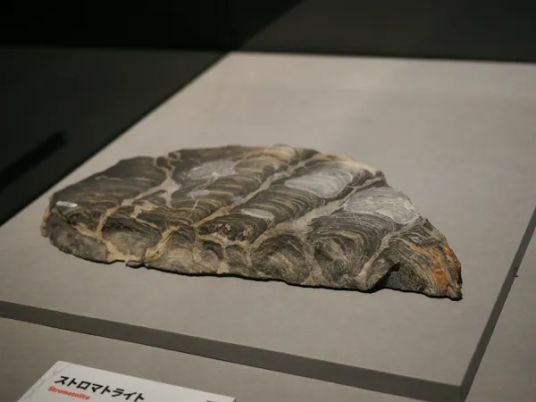
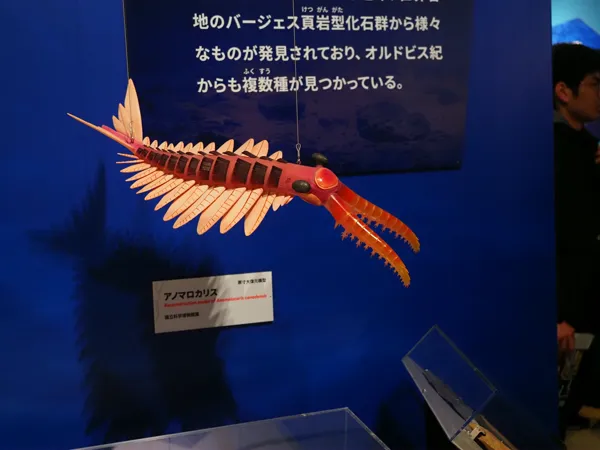
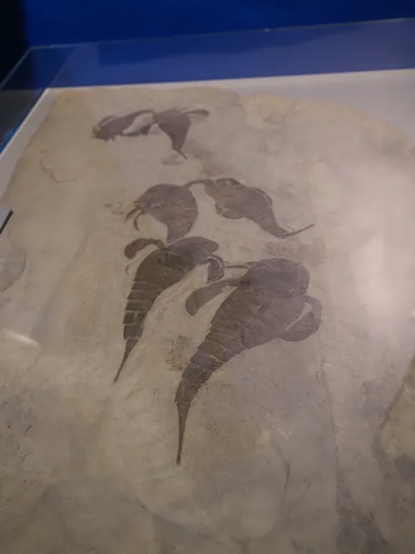
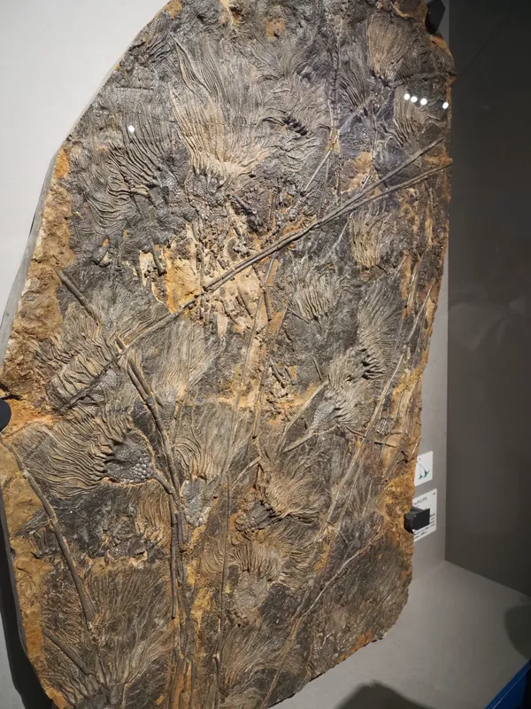
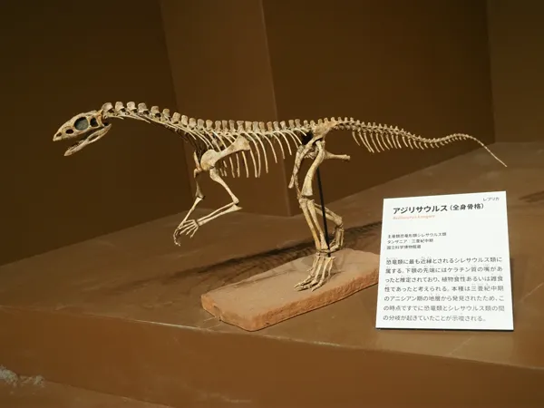
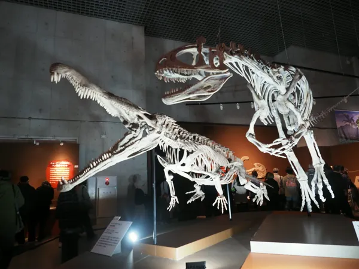

上野の国立科学博物館で開催されていた特別展「大絶滅展―生命史のビッグファイブ」に足を運んできた

開催期間は2025年11月1日（土）～2026年2月23日（月・祝）。地球史における主要な5回の大量絶滅（ビッグファイブ）をテーマにした展示

  <figure>
      
      <figcaption>
          <h4 style="margin-top: 10px;">大絶滅スフィア</h4>
      </figcaption>
  </figure>

## 五大大量絶滅（ビッグファイブ）

展示の軸となる「ビッグファイブ」は、地球の長い歴史の中で特に規模が大きかった絶滅イベントの総称

### 1. オルドビス紀末（約4億4300万年前）
* **特徴:** 地球の急激な寒冷化（氷河期）と、その後の急激な温暖化。これに伴い海水面が大幅に変動した
* **被害:** 海水温の低下と酸素不足により、三葉虫や筆石など海洋生物の約85%が消滅した

### 2. デボン紀末（約3億7200万年前〜3億5900万年前）
* **特徴:** 海洋の酸素が極端に不足した「海洋無酸素事変」。この絶滅は一度ではなく、数百万年かけて段階的に起きた。陸上植物の繁茂が、逆に海の生態系を崩したという説が有力
* **被害:** 巨大な板皮類（ダンクルオステウスなど）やサンゴ類が大きな打撃を受けた

### 3. ペルム紀末（約2億5200万年前）
* **特徴:** 地球史上最大・最悪の絶滅。別名「大絶滅（The Great Dying）」
* **原因:** 現在のロシア・シベリアでの超大規模な火山噴火（シベリア・トラップ）。猛烈な温暖化、酸性雨、海洋の酸性化が引き起こされた
* **被害:** 海洋生物種の約96%、陸上脊椎動物の約70%が絶滅した。地球規模での凄まじい環境変化が起きたとされる

### 4. 三畳紀末（約2億100万年前）
* **特徴:** 超大陸パンゲアの分裂に伴う大規模な火山活動。急激な気候変動と海洋酸性化が発生した
* **結果:** ワニに近い仲間の多くが絶滅。ライバルがいなくなったことで、恐竜の黄金時代がここから始まった

### 5. 白亜紀末（約6600万年前）
* **特徴:** 最も有名な絶滅。メキシコのユカタン半島への巨大隕石（小惑星）の衝突。およびインドでの大規模な火山活動（デカン・トラップ）。隕石だけでなく火山による環境悪化も要因として語られる
* **被害:** アンモナイトや、鳥類を除く全ての恐竜が絶滅した

---

・ペルム紀末：史上最大の絶滅
巨大な火山活動による猛烈な温暖化で、地球上の全生物の約96%が消滅した「大絶滅」

・白亜紀末：最も有名な絶滅
巨大隕石の衝突により、アンモナイトや鳥類を除く全ての恐竜が姿を消した

・現在:現在は第6の大量絶滅とも言われている
「人間活動」が引き金となり、自然状態の100〜1000倍という異常な速さで約100万種が絶滅の危機に瀕しているとされる

---

## 展示と体験

### 多様な標本群
展示は地球史や過去の大規模絶滅が発生した時期に焦点を当てている。古生物から現代に至るまで、岩石、植物、軟体動物、節足動物、魚類、両生・爬虫類、哺乳類といった多様な種の標本が並ぶ。実物、レプリカ、模型など、その形態は様々

  <figure>
      
      <figcaption>
          <h4 style="margin-top: 10px;">ストロマトライト実物</h4>
      </figcaption>
  </figure>

  <figure>
      
      <figcaption>
          <h4 style="margin-top: 10px;">アノマロカリス原寸模型</h4>
      </figcaption>
  </figure>

  <figure>
      
      <figcaption>
          <h4 style="margin-top: 10px;">ユーリプテルス(ウミサソリ)実物</h4>
      </figcaption>
  </figure>

  <figure>
      
      <figcaption>
          <h4 style="margin-top: 10px;">スキフォクリニテス実物</h4>
      </figcaption>
  </figure>

  <figure>
      
      <figcaption>
          <h4 style="margin-top: 10px;">アジリサウルス,全身骨格レプリカ</h4>
      </figcaption>
  </figure>

  <figure>
      
      <figcaption>
          <h4 style="margin-top: 10px;">レドンダサウルス＆クリオロフォサウルス,全身骨格レプリカ</h4>
      </figcaption>
  </figure>

### 撮影禁止エリアの写真展示
撮影禁止エリアにあった写真展が印象に残った。プロが撮影した動物たちの空気感や、リアルな表情が捉えられている。骨格や模型とはまた異なる、生きている生命の躍動を感じさせる内容だった

### 館内の状況と鑑賞
館内は混雑しており、一つひとつの展示に時間をかけて向き合うことはできなかった。他者の邪魔にならないよう注意しつつ、手早く撮影可能な展示を記録しながら回った。じっくり鑑賞できる状況であれば、一日滞在しても飽きない情報量と感じた

### ミュージアムショップ
ショップは展示に関連した商品が充実しており、今回も眺めているだけでとても楽しめる内容であった。素晴らしいガイドブックやかわいらしいぬいぐるみ等、多種多様なグッズで埋められていた

---

### まとめ
混雑のため駆け足での鑑賞となりましたが、地球史における生命の変遷と絶滅を物理的な標本群を通して確認できる非常にありがたい機会でした。もし次回、同じテーマで開催されることがあったらまた足を運んでみたい
