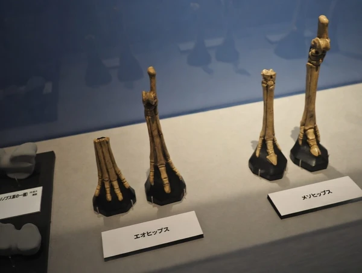
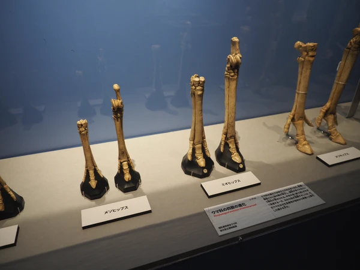
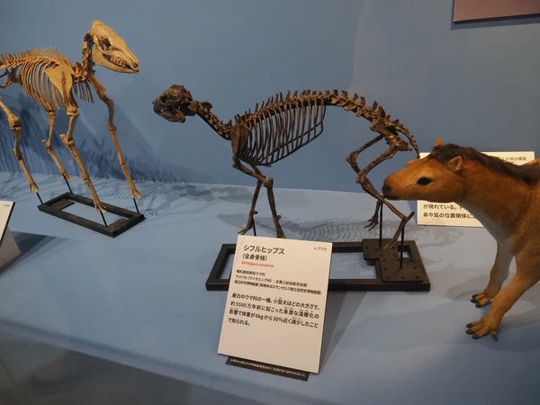
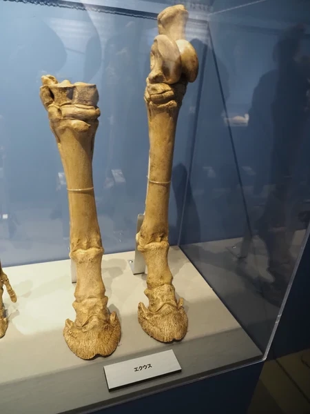

先日、「上野国立科学博物館で開催されていた大絶滅展―生命史のビッグファイブ」2025年11月1日(土)～2026年2月23日（月・祝）に足を運んできました

地球の生命史を巡る数々の壮大な展示の中で、ふと興味を惹かれた展示がありました

馬の進化について骨格と共にわかりやすく並べられていたブースです

振り返りと共に、改めて個人的な資料としてもまとめておこうと思います

# 馬の進化:森から草原へ

馬の進化は、かつて森の中で木の葉を食べていた小さな動物が、広大な草原を駆ける「単蹄」の動物へと変わったとされている

> 馬は「有蹄類（ゆうているい）」という大きなグループの中に含まれ、その中でさらに細かく分けると「奇蹄類（きているい）」に属する。それが最終的に指が1本になったので「単蹄（たんてい）」と呼ばれる。つまり**蹄が一つ**

例えばウシの仲間に属するカモシカ(ウシ科ヤギ亜科カモシカ属)は**蹄が二つ**となっている。2本の指が自由に動くため、悪路や急斜面での踏ん張りがきき切り立った岩場をスイスイ登れる

以前に長野で出会ったカモシカは斜面をスイスイと登っていった。その後、試しに登ってみようと思ったら滑落しそうなほどの斜面で登るのが大変だった

---
## 馬の進化プロセス一覧

| 時代 | 学名 | 特徴と蹄の数 |
| :--- | :--- | :--- |
| **始新世初期** | **Sifrhippus** (シフルヒップス) |蹄の原型。 現在、ウマ科で最も古い属とされる。猫～小型犬程度のサイズ。前肢4指、後肢が3本|
| **始新世** | **Eohippus** (エオヒップス) | 小～中型犬程度のサイズで森林生活をしていた。|
| **漸新世** | **Mesohippus** (メソヒップス) | 体格が羊ほどに。前後とも3指になり、中指(第3指)が発達。 |
| **漸新世後期** | **Miohippus** (ミオヒップス) | メソヒップスより大型。3指で体重を分散。進化の分岐点となる属。 |
| **中新世** | **Merychippus** (メリキップス) | 草原に進出。3指、実質的に中央の蹄のみが地面についた。 |
| **鮮新世〜現代** | **Equus** (エクウス) | 現代のウマ、ロバ、シマウマを含むウマ属。完全な単蹄。高速走行と硬い草の咀嚼に特化。 |

---

---
## シフルヒップス

約5,500万年前（始新世初期）に北米に生息していた、ウマ科の最も初期の属の一つ

北米で誕生した彼らが、当時つながっていた陸橋を通ってヨーロッパなどへ広がったことで、ウマ科というグループが地球規模で繁栄する土台を作る

### 当時の環境

PETM（始新世温暖化極大期）と呼ばれる、激動の約20万年間に起きた注目のできごと

PETMによる急激な温暖化によって、北極圏の環境が激変

北極のジャングル化: 北極周辺の気温が上昇、巨大な針葉樹や湿地帯が広がる、温暖で豊かな森に変わる

これにより、北米とヨーロッパをつなぐルートが「動物たちがエサを食べながら移動できる快適な道」となる

### シフルヒップスの歩み

1. 温暖化開始： 北米にいたシフルヒップスが暑さでどんどん小型化（約30%ダウン）

2. 移動： 小さくなった彼らが、温暖化した北極を通ってヨーロッパへ進出

3. 寒冷化： 温暖化のピークが過ぎると、北米とヨーロッパの両方で、彼らの体は再び大きくなった

## 蹄（ひづめ）の進化：なぜ指は減ったのか？

馬の進化において最も顕著な変化は、**「指の数の減少」**

1. **森林期（多指）：** 初期のシフルヒップスやエオヒップスは、ぬかるんだ森の地面を歩く際、体重を分散させるために指が多く、クッションのような肉球を持っていたとされる。
2. **移行期（3本指）：** 2000万年前ほどから気候が乾燥し森林が減少すると、馬たちは開けた草原へ出ざるを得なくなる。外敵から逃げるために「歩幅」と「速度」が必要になり、脚が長く進化し始める。
3. **草原期（単指）：** 最終的に、最も力の効率が良い**中央の指**（中指）が巨大になる。他の指は退化して「副蹄」となった。これが現代の馬に見られる「蹄」となった。

<figure>
    
    <figcaption>
        <h4>完成した馬の蹄</h4>
    </figcaption>
</figure>

 **メモ：** 馬の足の「管骨（かんこつ）」の横にある細い骨は、かつての指の名残と言われている。

## 歯の進化：食べ物の変化

蹄と同時に進化したのが「歯」

* **低冠歯（ていかんし）：** 森の柔らかい葉を食べるための低い歯。(エオヒップス等の時代)
* **高冠歯（こうかんし）：** 草原の硬いイネ科植物（シリカを含み歯を削ってしまう）をすり潰しても平気なように、あごの中に長い予備(埋まっている)を持ち、摩耗した分だけ少しずつ押し出されてくる背の高い歯(現代のウマ)

## 進化の軍拡競争(アームズ・レース)

1. 武器（シリカ）と防具（高冠歯）を交互に強化し合う「軍拡競争」

   「植物の攻撃（削る力）」vs「動物の防御（耐える力）」

1. 草原が広がる: 森林が減り、硬いイネ科の草が増える。

1. 植物の進化: シリカを多く蓄える草が生き残る。

1. ウマの進化: 低冠歯のウマは減り、歯が長い高冠歯のウマだけが生き残る。

**結果:** 現代のウマは、一生の間に数センチメートルも歯を摩耗させながら、広大な草原の覇者となる。

---

## まとめ

馬の進化は、単なる「大型化」ではなく、「草原という新しい環境で生き残るための高度な専門化」のプロセスなのでしょう

シフルヒップスの小さな一歩が、現在私たちが目にする力強いエクウスの走りに繋がっている。そんなことを考えながら大絶滅展の展示を思い出します

大絶滅展はとても多くの方々が訪れており、少しでもスムーズにと通行を妨げないようにとさっと一瞬の鑑賞と撮影を心掛けてきました

そんな中で、人が少なくじっくり鑑賞できた馬の展示が特に記憶に残ったのもまた博物館での出会いの面白さだなと感じた一日でした

