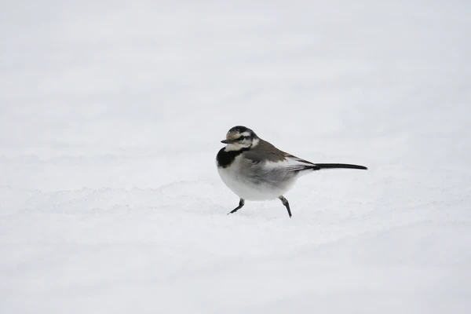
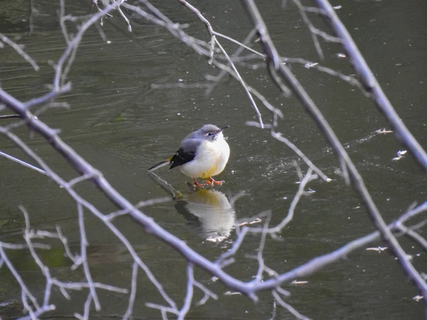

## はじめに
冬季、ハクセキレイ等のセキレイ類が氷や雪の上に留まる姿はよく観察される

ツグミやジョウビタキ(彼らも雪の上で活動はしている)といった他の鳴禽類と比較し、なぜセキレイが氷上という環境を効率的に利用しているように見えるのだろうか？

その要因を採餌・形態・身体の作りという点から考えてみた

## 1. 採餌戦略と嘴（くちばし）の形状
セキレイが氷上に留まる主な動機の一つはやはり食物資源の確保だろう

### -精密なピンセット型の嘴-

#### セキレイの嘴は細長く、先端が鋭い。これは以下の利点を持つ

**微小な獲物の採取:** 氷の表面や亀裂に出てきた真冬でも羽化するフユユスリカ等の虫、そして風で運ばれてきた虫も対象となるのだろう。氷上ではこれらの微小昆虫を的確につまみ出せる。

ツグミのように「土を掘って餌を見つける」必要がない。硬い氷の上でも表面の物体を器用に採取可能

### -氷上の視認性-
氷の上には遮蔽物がないため、小さな黒い昆虫を視覚的に発見しやすい

## 2. 運動形態：ウォーキングによる安定性
鳥類の移動方式は主に「ホッピング（跳ねる動き）」と「ウォーキング（歩行）」がある。

* **セキレイ（ウォーキング）:** 左右の足を交互に出して進む。常に片方の足が接地しているため、氷上でも重心移動が安定する

* **ツグミ・ヒタキ（基本はホッピング）:** 両足で跳ねるため、着地時の安定性など氷上での負担が考えられる。
ツグミも二足歩行をする光景は見られるが、セキレイと比べた体型や体重、そして彼らの餌場から考えるとわざわざ歩きにくい氷上に出るメリットが無い

### 尾羽による平衡制御
セキレイ特有の「尾羽を上下に振る動作」の役割は諸説あるが、バランス保持にも有用だろう

歩行と連動して重心調整を行うことで、氷上での安定的な移動も可能

## 3. 耐寒メカニズムの検討
セキレイにおいては、カモ類や水辺の鳥に見られる「ワンダーネット（奇網）」といった熱交換系機構が彼らほどは巨大には発達はしてはいないかもしれない

しかし、彼らの行動形態的にも凍傷や過度な体温低下を回避する策は持っている筈だ

### 接地面積の最小化
セキレイの足は細く、指の接地面積がとても小さい

物理的に氷に触れる面積を最小化することで、足から氷へ逃げる熱量は少なくなる

### 簡易的な対向流熱交換
多くの鳥では水鳥達ほど大規模な構造ではないものの、脚部の動脈と静脈が近接して配置される簡易的が熱交換は行われているという論文があった

足先へ行く血液の熱を戻りの血液に回収することで、体幹の温度低下を防ぐ仕組みだろう

### 足部組織の耐性
鳥類の足（足首から先）は主に骨、腱、鱗で構成され、筋肉がほとんど存在しない

代謝要求が低いため、比較的低い組織の温度で機能が維持できる。つまり熱損失を最小限に抑えられる

---

## 比較まとめ

| 特徴 | セキレイ類 | ツグミ・ヒタキ類 |
| :--- | :--- | :--- |
| **移動様式** | ウォーキング（交互歩行） | ホッピング（基本は両足跳び） |
| **嘴の機能** | 精密なつまみ出し | 掘削・破砕・捕食 |
| **主要餌場** | 氷上・水際・舗装路 | 森林・草地・地中 |
| **熱交換系(推定)** | 簡易対向流・小面積接地 | 簡易対向流 |

---

## まとめ
セキレイが氷上を利用できる、している理由は**滑りにくい歩行形態・接地面積を絞った脚部構造・表面の獲物を拾うのに適した嘴**という総合的な所謂スペック的なもので、冬場の氷上環境での採餌にも有利に働いているだろうことが推測できる

改めて、身近な鳥のこうした細かな棲み分けや生態の違いを見るのは面白いと感じました

氷の張った水面を歩くセキレイを見かけたら、次回もじっくり観察したいものです

